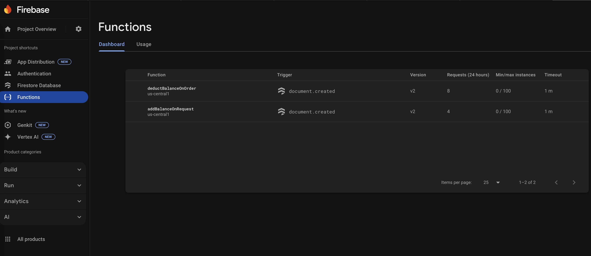

# 🛣️ 3D Map Generator – Web-Based Road Design App (Demo)

## 📌 Overview

**3D Map Generator** is a web application that allows users to create, customize, preview, and export 3D road models, including buildings, sidewalks, and other urban elements. The app offers a seamless 3D editing experience through a browser and uses a credit-based system for managing road exports.  


<p align="center">
  <strong>App Icon</strong><br>
  
</p>

🚧 This is a work-in-progress demo — not all features are fully implemented yet!

🚧 To use Firebase Cloud Functions, a Blaze Firebase plan is required.


### ✅ Key Features
- User authentication and account management.
- 3D road and building customization using Three.js.
- Export functionality to `.obj` or `.used` file format.
- Credit system for tracking road exports.
- Admin dashboard for monitoring and credit approval (future).

---

## 🔧 Tech Stack

| Layer     | Technology                                  |
| --------- | ------------------------------------------- |
| Frontend  | React, Three.js                             |
| Backend   | Firebase (Firestore, Auth, Cloud Functions) |
| Auth      | Firebase Authentication                     |
| 3D Engine | Three.js                                    |
| Export    | OBJExporter (three-stdlib)                  |
| Hosting   | Firebase Hosting (optional)                 |

---

## 🧠 Application Architecture (C4 Model)

### Level 1: System Context

<!--  -->

- **Users**: Interact with the app to create and export 3D roads.
- **Admins**: Monitor usage and manage credits (not implemented).
- **System**: 3D Map Generator (Web App).

---

### Level 2: Container Diagram

<!--  -->

- **Frontend** (React): Login, Dashboard, Road Editor, Settings.
- **Backend** (Firebase):
  - **Auth**: Login/signup via Firebase Authentication.
  - **Firestore**: Stores user data, credit balances, export logs, and admin configs (e.g. object price).
  - **Cloud Functions**: Handles business logic (export deduction, balance addition).
- **External**: Browser rendering + optional payment gateway (future).

---

### Level 3: Component Diagram

<!--  -->

- `Login`, `Dashboard`, `RoadEditor`, `Settings` Pages.
- Cloud Functions:
  - `addBalanceOnRequest`: Adds credits after manual review.
  - `deductBalanceOnOrder`: Deducts credits on export.
- Firestore:
  - Stores user profiles, balances, export history, and configs.

---

### 🖼️ System Diagram (C4 Diagram)

<p align="center">
  
</p>


---

## 🧱 Project Structure

```
/src
  /pages
    - Login.js
    - Dashboard.js
    - RoadEditor.js
    - Settings.js
  /firebase
    - firebaseConfig.js
/backend
   - functions/
        - addBalanceOnRequest.js
        - deductBalanceOnOrder.js
```
🚧 Refer to the files and folders to see the full structure!

---

## 👣 App Workflow

### 1. User Onboarding
- Sign up or log in with email/password via Firebase Authentication.

### 2. Road Editing
- Navigate to the Road Editor.
- Add roads, buildings, sidewalks, and trees (hard-coded).
- Customize color, scale, and orientation.
- Preview in 3D using OrbitControls (zoom, pan, rotate).

### 3. Exporting a Road
- Export generates a `.obj` or `.used` file of the current scene.
- Upon export:
  - A cloud function `deductBalanceOnOrder` deducts credits from the user’s balance.
  - Export metadata is stored in Firestore.
  - Download is triggered client-side.

### 4. Credits System
- Users purchase credits from the Settings page.
- Payment requests are saved in the database.
<!-- - Admin manually approves via the Admin Dashboard (future, currently the cloud function accept it directly). -->
- Cloud Function `addBalanceOnRequest` adds the credit amount to the user's profile.

---

## 🧩 Key Components & Responsibilities

| Component                              | Responsibility                                         |
| -------------------------------------- | ------------------------------------------------------ |
| `RoadEditor.js`                        | 3D editing with Three.js, exporting models             |
| `Settings.js`                          | Credit plan selection, payment request                 |
| `Cloud Function: addBalanceOnRequest`  | Increases credit after purchase                        |
| `Cloud Function: deductBalanceOnOrder` | Deducts credit on each export                          |
| `Firestore`                            | Stores users, plans, balances, export logs and configs |
| `Firebase Auth`                        | User sign-up/login                                     |

---

## 🚧 Challenges & Design Considerations

### ⚠️ Potential Issues & Solutions

| Issue                                | Solution                                                                        |
| ------------------------------------ | ------------------------------------------------------------------------------- |
| Race conditions on balance deduction | Use Firestore transactions to ensure atomicity.                                 |
| Unauthorized access to editor/export | Protect routes with `ProtectedRoute` component and Firebase Auth rules.         |
| Limited budget for backend scaling   | Firebase offers scalable pay-as-you-go pricing, reducing upfront cost.          |
| Payment handling                     | Approval by cloud function for simplicity; gateway/payments can be added later. |

---

## 📷 Screenshots

<p align="center">
  <strong>Login/SignUp Page</strong><br>
  
</p>

<p align="center">
  <strong>Road Editor</strong><br>
  
</p>

<p align="center">
  <strong>Settings Page</strong><br>
  
</p>

<p align="center">
  <strong>My Orders Page</strong><br>
  
</p>


- Admin Dashboard  
  ![Admin Dashboard Placeholder] (future)


<p align="center">
  <strong>Firebase Authentication</strong><br>
  
</p>

<p align="center">
  <strong>Firebase Database</strong><br>
  
</p>

<p align="center">
  <strong>Firebase Cloud Functions</strong><br>
  
</p>

---

## ✅ Summary

This project structure enables a small team to deliver a fully functional 3D road modeling application with minimal infrastructure complexity. By leveraging Firebase for backend services and Three.js for frontend rendering, the team avoids reinventing the wheel and keeps the system scalable for future growth (e.g., adding payment gateways, cloud export storage, real-time collaboration, etc.).

---

## ✍️ Authors

- Najy Fannoun

---

## 📄 License

MIT License